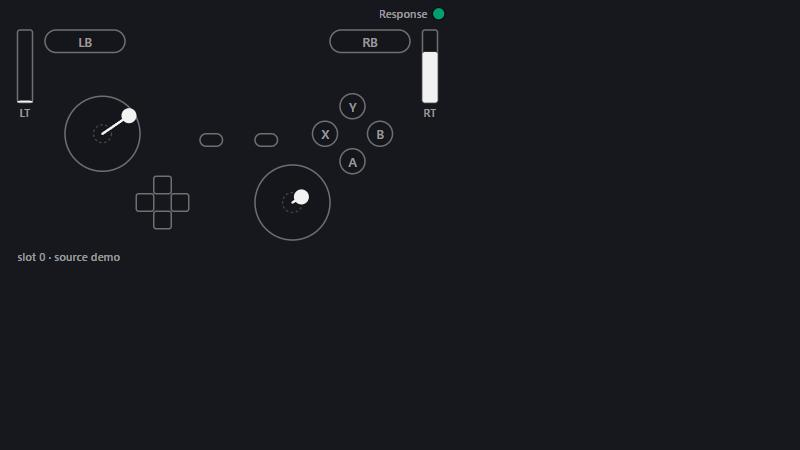

# Controller Response Overlay

A lightweight, **read-only** XInput controller viewer for Windows. It shows the buttons, triggers and sticks that
XInput reports for one slot, plus one small status lamp. By design it only calls `XInputGetState`; it does not write
to, remap or inject controller input (checked by a source-scan test).



**Status: Phase 1 (MVP).** Phase 1 has been manually verified as a read-only XInput slot viewer for one Xbox Series
controller over Bluetooth, using XInput slot 0, in the Claude desktop app's built-in browser and as an OBS 32.2.2
Browser Source — see [Verified so far](#verified-so-far). Everything outside that is untested. See [DESIGN.md](DESIGN.md) (Korean) for the
design; later phases there are **design only** (not implemented).

Labels used below: **Verified** = checked in the manual run; **Observed** = a measured value from that run, not a
guarantee; **Untested** = not tried; **Unknown** = could not be separated or measured; **Design only** = not implemented.

## What it shows

- A, B, X and Y; LB and RB; Back (View) and Start (Menu); the D-pad; L3 and R3 (the stick ring lights up)
- LT and RT as analog bars (0–255)
- Left and right stick direction and magnitude, raw. No deadzone is applied; the standard deadzone is drawn as a
  faint dashed ring for reference only.
- A status lamp that is a **data-availability signal only**:
  - ● green: the reader is reading the selected XInput slot and the page is receiving it
  - ○ gray: no state for the selected slot — nothing connected there, disconnected, or the reader/server stale or gone

  The lamp says nothing about response speed, latency, input quality or controller health. Each state has its own
  shape as well as its own colour.

## Run

Requires Windows and Python 3.12 or newer (verified only with 3.12.10). It uses the standard library only.

```bash
python -m cro
```

Or double-click `run-overlay.bat` in the repository folder: it checks for Python 3.12+ on PATH, starts the reader in
its own window, and keeps the window open if something fails. It passes options through
(`run-overlay.bat --demo`). Close the window or press Ctrl+C to stop; the overlay then turns gray. Because it runs in
its own window, it keeps going for as long as you leave it open. Only one reader can use a port: starting a second
one on the same port stops with `cannot listen on 127.0.0.1:47820` instead of running alongside the first.

Then open `http://127.0.0.1:47820/` in a browser. Pick the slot explicitly with `?slot=N`; `http://127.0.0.1:47820/state`
lists which slots currently have state.

```bash
python -m cro --demo
```

`--demo` uses a fake pad on slot 0, so you can preview the overlay with no controller. Every 30 s the fake pad unplugs
for 3 s, so you can see the gray lamp too. (Only tried on Windows.)

**OBS Browser Source: verified in OBS 32.2.2 (one environment).** Add a Browser Source with the localhost URL (not
Local file), keep OBS's default custom CSS, and use for example `http://127.0.0.1:47820/?slot=0&layout=streamer` at
560×330 — the size used in the test, a starting point rather than a requirement. See
[Verified so far](#verified-so-far) for what was and wasn't checked. Keep the reader (`python -m cro`)
running for as long as OBS shows the source; when it stops, the overlay turns gray with neutral inputs.

**Hide/show hotkey: Ctrl+Shift+F10 — verified with OBS in the foreground.** The reader polls the key combo (no
keyboard hook) and toggles visibility on every open page. In a manual check (OBS 32.2.2 in the foreground) each press
toggled the overlay exactly once: hidden, then shown again. The keys are not consumed, so the focused app also receives
them; pressing it while a game is in the foreground has not been checked.

### Page options (query string)

| option | values | default |
|---|---|---|
| `layout` | `full`, `compact`, `streamer` (full + outline, 1.5×) | `full` |
| `slot` | `auto` (lowest connected XInput slot), `0`–`3` | `auto` |
| `scale` | 0.25–6 | 1 (streamer 1.5) |
| `label` | off, `response`, `ko` (반응) | off |
| `info` | `1` shows `slot n · source unknown` | off |
| `debug` | `1` shows raw values, packet number, missed changes | off |
| `bg` | transparent, `dark`, `light` | transparent |

## Verified so far

One manual run on 2026-10-03 against commit `9b516b0` (code unchanged since; later commits are documentation only).

| Environment | |
|---|---|
| OS / Python | Windows 10.0.26200, Python 3.12.10 |
| Controller | one Xbox Series controller, Bluetooth, XInput slot 0 |
| Other software | Steam running with Steam Input **off** for this controller; no mapper, virtual controller, game or OBS running |
| Browser | the Claude desktop app's built-in browser pane |
| Server | listening on `127.0.0.1:47820` only |

**Verified**

- [x] Offline tests: 23 passed
- [x] Demo mode: full / compact / streamer layouts, fake unplug → gray → green, page reload
- [x] Buttons pressed one at a time in a set order were observed in that order as the matching inputs: A, B, X, Y, LB,
  RB, View, Menu, L3, R3, D-pad up / down / left / right, and the up+right diagonal
- [x] LT and RT both reached 255, and intermediate values were observed
- [x] Both sticks were shown in the expected direction for up / down / left / right
- [x] Compact and streamer layouts with the real controller
- [x] Controller powered off → slot 0 gray; after Bluetooth reconnect → green again on the same slot 0, and an A press
  was observed
- [x] Empty slot selected (`slot=3`) → gray, no buttons lit
- [x] Reader/server stopped → page switches to the stale gray state with neutral inputs
- [x] Renderer tab closed → the reader kept running
- [x] After the reader was stopped, Windows `joy.cpl` still recognised the controller
- [x] Window minimized and restored → no phantom buttons on return

**OBS Browser Source (OBS 32.2.2)** — 2026-10-03, same code, Windows, Python, controller, slot and Steam Input state as
above; no game, mapper or virtual controller running during the test.

- [x] Localhost URL (not Local file), OBS default custom CSS, over a light-gray Color source: background transparent,
  no black rectangle, no visible halo, no clipping or scrollbars
- [x] Inputs shown in the OBS preview: buttons, D-pad including up+right, LT/RT half and full, both sticks in four
  directions — partly from captured preview frames, partly from the tester watching OBS, cross-checked against
  `/state`
- [x] Layouts: full, compact, and streamer at 560×330; inputs shown and cleared on release
- [x] Switching to another scene and back three times → green again, a new A press shown
- [x] Reader stopped with OBS open → gray with neutral inputs; reader restarted → green again on its own
- [x] OBS closed and reopened with the reader running → reader unaffected; the source reconnected and a new A press
  was shown
- [x] Empty slot (`slot=3`) → gray, `no controller`, nothing lit
- Readability note: on a light background the thin outlines, deadzone rings and small labels are hard to see.

Afterwards the tester used the overlay (streamer layout, bottom-right) in one real OBS recording of Dark Souls
Remastered and reported that it displayed the inputs correctly. That is the tester's observation only; no log or capture
was kept, and it is not evidence about game input or performance.

**Observed values** (one run; approximate; not guarantees and not latency measurements)

- Raw XInput state vs. drawn buttons: no mismatch lasting 3 or more frames in ~4,993 observed draw frames. This is an
  observation about consistency between the raw XInput state and the overlay's visual state — it is **not** an
  end-to-end latency measurement from physical input to a game or screen.
- Stale switch: the configured stale threshold is 1.5 s, and the page checks periodically on top of that. The switch to
  gray/neutral was observed ~1.6–1.7 s after the last update. There is no strict "within 1.5 s" guarantee.
- Server restart with the page open: back to green after ~1.8 s.
- Controller power-off → green again: ~12 s round trip, which includes ~5 s of the tester waiting and the Bluetooth
  reconnect. The overlay's own share of that delay is **unknown**.

## Not yet verified

**Untested**

- OBS: runs of 30 minutes or more (the planned long run was not done), source hide/show, other OBS versions, timing of
  the gray/green transitions inside OBS
- Ctrl+Shift+F10 hotkey with a game in the foreground (whether the game reacts to the keys)
- Steam Input on
- Running alongside a mapper or virtual controller
- Whether running it next to a real game leaves that game's input unaffected — no game was run
- Other browsers
- Multiple controllers / slots
- Other controller models
- Wired and wireless-dongle connections
- Resource use and stability over 30 minutes or more
- Whether rendering actually pauses while the window is minimized
- Full-scale endpoints in every stick direction (only "up" reached ±32767 in the run)

**Unknown / not measured by this tool**

- End-to-end latency, input speed, input health
- Whether a slot's state comes from a physical controller or from something else (see below)
- The overlay's own share of the reconnect delay

## Limitations

- **It does not identify where a slot's state comes from.** XInput gives no device identity. The state it shows could
  come from a physical controller, from a translated or virtual XInput device created by Steam Input or a mapper, from
  something a game or other software outputs, or from another intermediary layer — the overlay does not tell these
  apart. That's why the info line says `source unknown`; `slot=auto` just picks the lowest slot number.
- It is a read-only observer of `XInputGetState`: no vibration, no virtual controller, no remapping, no input injection,
  no hooks, no DLL injection, no access to other processes (by design; checked by a source scan in the tests).
- Not interfering with game input cannot be proven without a game; the `joy.cpl` check above only shows Windows still
  recognised the controller after the reader stopped. It is not a guarantee for every game, anti-cheat or input path.
- Results from the built-in browser and OBS 32.2.2 do not carry over to other browsers or other OBS versions.
- Polling runs at 120 Hz as a current implementation setting. Times are when this overlay read the state, not when the
  controller sent it, and polling misses states that come and go between two reads (`debug=1` counts those from XInput
  packet-number gaps). This is not exact event timing or a latency measurement.
- It saves no files and keeps no logs. The server listens on `127.0.0.1` only and answers only local `Host` headers.
- It makes no claim about latency, polling rate of the hardware, FPS, battery, cable condition, controller health,
  fatigue, or performance impact on games.

## Tests

The tests run offline and need no controller or game:

```bash
python -m pytest
```

`tests/test_readonly.py` scans the package source for anything that would write to a device, inject input, hook the
keyboard, touch another process, change focus or write files.

## Roadmap

Only Phase 1 exists. Everything below it is **design only** — not implemented or verified.

1. **Phase 1 (this release):** read-only XInput slot viewer, browser page, gray/green data-availability lamp.
2. **Phase 1b (design only):** a standalone click-through, always-on-top window for players who don't stream.
3. **Phase 2 (design only):** a dual viewer for RAW (physical device) vs. OUTPUT (virtual pad), with source
   classification. It first needs a prototype for device identification (Raw Input / HID / GameInput).
4. **Phase 3 (design only):** yellow/red that would compare input-timing consistency to *your own* baseline (gray until
   there's enough baseline). It would say nothing about causes and never change input.

## 한국어 요약

XInput이 보고하는 패드 상태(버튼, 트리거, 스틱 방향과 세기)를 한 slot씩 보여 주는 **읽기 전용** viewer입니다.
`XInputGetState`만 읽고, 패드에 쓰거나 입력을 바꾸거나 보내지 않습니다(설계, 소스 스캔 테스트로 확인). 상태등은 **데이터가
들어오는지**만 뜻합니다(초록 ●: 선택 slot을 읽고 있음, 회색 ○: 그 slot에 상태가 없거나 끊겼거나 reader가 멈춤). 반응 속도,
지연, 패드 상태를 판정하지 않고, 그 slot의 출처(물리 패드, Steam Input·매퍼가 만든 변환·가상 상태, 게임 출력, 다른 중간 계층)도
구분하지 못합니다.

수동 검증(2026-10-03, 코드 `9b516b0`)은 Windows 10.0.26200 · Python 3.12.10 · Xbox Series 패드(Bluetooth, slot 0) ·
Steam Input 꺼짐 · 앱 내장 브라우저 한 환경뿐입니다. reader가 멈추면 페이지가 회색·중립으로 바뀌는 데 설계값은 1.5 s,
실측은 약 1.6–1.7 s였습니다. 같은 환경에서 OBS 32.2.2 Browser Source도 확인했습니다(투명 배경, 입력 표시, 세 레이아웃,
장면 전환, reader·OBS 재시작 후 복구, 빈 slot). 실제 다크소울 녹화 한 번에서도 정확히 표시됐다는 사용자 보고가 있습니다.
Ctrl+Shift+F10 단축키는 OBS를 앞에 둔 상태에서 숨기기·보이기가 한 번씩 정확히 동작했습니다(게임을 앞에 둔 상태는 미확인).
OBS 30분 이상 장시간, 게임을 앞에 둔 상태의 단축키, 다른 패드·연결 방식·브라우저·OBS 버전, Steam Input·매퍼 공존, 게임 입력에 미치는 영향은
미검증입니다. 설계 문서는 [DESIGN.md](DESIGN.md)에 있습니다(Phase 1b·2·3은 설계만 있음).

## License

MIT
